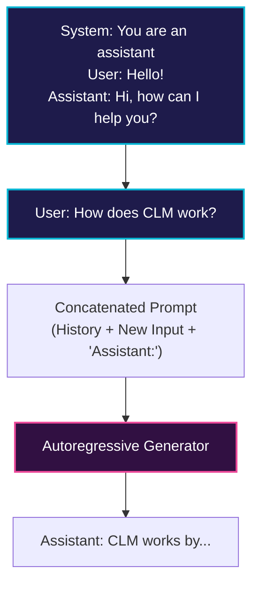

# Conversational AI Agents (Chatbots)

Causal Language Models serve as the core generative engine for modern conversational agents.

## 💡 Overview
Causal language models are adapted for dialogue by formatting multi-turn conversations as single, continuous text sequences. The dialogue history acts as the preceding context (prefix) and the chatbot's response is generated autoregressively.

## 📊 Conversation Flow Diagram

## 🛠️ Mechanism
- User inputs and assistant outputs are appended to the context.
- Special chat templates (like ChatML or Llama templates) structure the turns with tokens like `<|im_start|>` and `<|im_end|>`.
- The model generates the next sequence of tokens until it outputs the end-of-turn token.

---
[⬅️ Back to README](../README.md)
