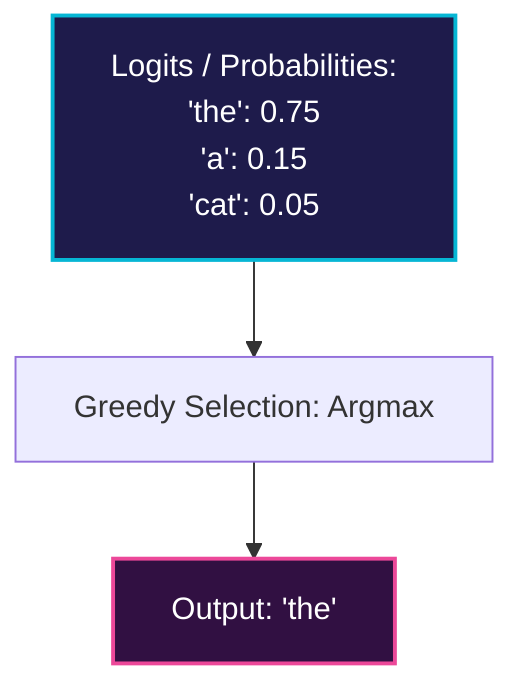

# Greedy Search Decoding

Greedy search decoding is the simplest decoding strategy for autoregressive models.

## 💡 Overview
During generation, the model outputs a probability distribution over the vocabulary for the next token. Greedy search simply selects the token with the highest probability at each step.

## 📊 Selection Diagram

## 🛠️ Formulation
At step $t$, the selected token is:
$$x_t = \arg\max_{w \in \mathcal{V}} P(w \mid x_{1:t-1})$$

### Pros & Cons
- **Pros:** Fast, deterministic, computationally cheap.
- **Cons:** Often gets stuck in repetitive loops, lacks creativity, and might miss higher-probability sequences overall (due to locally optimal choices).

---
[⬅️ Back to README](../README.md)
