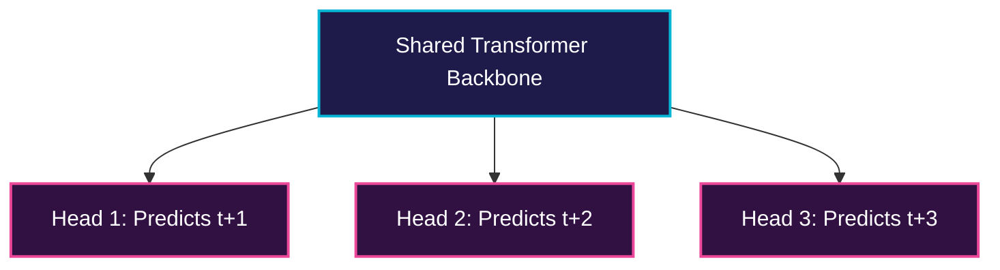

# Multi-Token Prediction (MTP)

Multi-Token Prediction modifies the standard next-token prediction task to predict multiple future tokens simultaneously.

## 💡 Overview
In standard CLM, the model uses a single prediction head to predict token $t+1$. Under Multi-Token Prediction (MTP), the model uses $N$ independent output heads to predict tokens $t+1, t+2, \dots, t+N$ in parallel, improving training representation learning and allowing faster speculative decoding during inference.

## 📊 Architecture Diagram

## 🛠️ Formulation
The loss is a weighted sum of the cross-entropy losses for each head:
$$\mathcal{L}_{MTP} = \sum_{i=1}^N \lambda_i \mathcal{L}_i$$
where $\mathcal{L}_i$ is the cross-entropy loss for predicting token $t+i$.

---
[⬅️ Back to README](../README.md)
