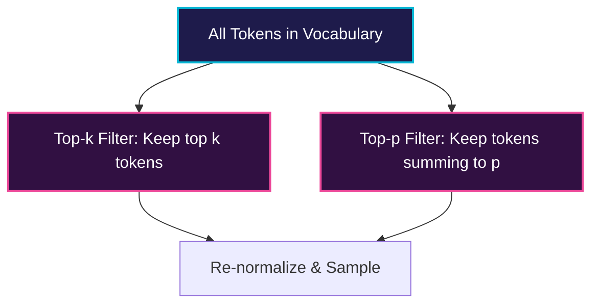

# Nucleus Sampling (Top-p) & Top-k

Nucleus (top-p) and Top-k sampling are stochastic decoding methods that introduce controlled randomness to improve text diversity.

## 💡 Overview
Stochastic decoding prevents models from falling into repetitive, boring text generation loops. Instead of picking the argmax, these methods restrict the sampling vocabulary dynamically.

- **Top-k Sampling:** Restricts the next token choices to the top $k$ most likely options.
- **Nucleus (Top-p) Sampling:** Dynamically adjusts the selection pool to include the smallest set of tokens whose cumulative probability exceeds the threshold $p$.

## 📊 Comparison Diagram

---
[⬅️ Back to README](../README.md)
