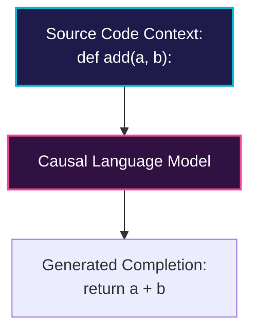

# Source Code Generation & Autocomplete

Causal language models excel at code generation and inline autocomplete.

## 💡 Overview
Causal language models are trained on massive code repositories (like GitHub). During inference, the existing source code up to the cursor position is fed as context, and the model predicts the succeeding characters, lines, or blocks of code.

## 📊 Autocomplete Process Diagram

## 🛠️ Key Strategies
- **Causal Generation:** Generates code sequentially from left to right.
- **FIM (Fill-in-the-Middle):** Used extensively in IDE extensions to insert code in the middle of existing files by providing both prefix and suffix context.

---
[⬅️ Back to README](../README.md)
