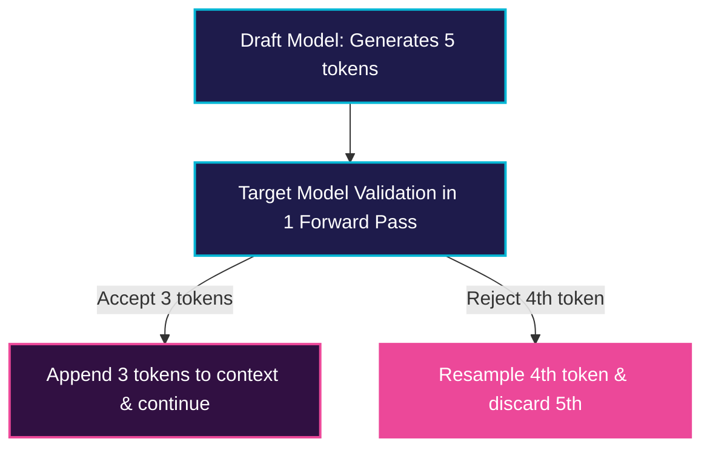

# Speculative Decoding

Speculative Decoding accelerates autoregressive decoding by generating candidate tokens with a smaller model and validating them with a larger target model.

## 💡 Overview
Autoregressive decoding is slow because each step requires running the entire model for a single token. Speculative decoding speeds this up by using a lightweight "draft" model to speculate several future tokens (e.g., 4 or 5 tokens). These are verified in a single forward pass by the primary "target" model, keeping the target model's output distribution.

## 📊 Speculative Validation Diagram

---
[⬅️ Back to README](../README.md)
