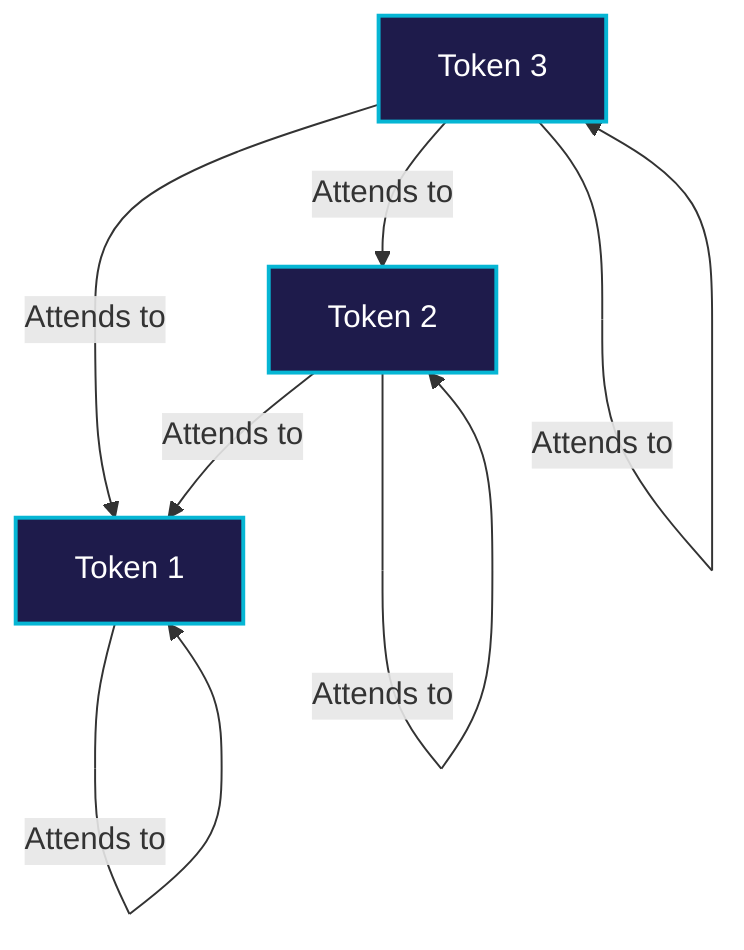

# Standard Autoregressive Masking

Standard Autoregressive Masking is the foundational mechanism used in decoder-only Transformer models (like GPT-series) to enforce causality during self-attention.

## 💡 Overview
During training, a model must not look at "future" tokens when predicting the current token. To achieve this, a lower-triangular attention mask is applied to the self-attention score matrix. This mathematically zeros out the attention weights from the current position to any subsequent positions.

## 📊 Masking Diagram

```mermaid
matrix
  [ 0  -inf -inf -inf ]
  [ 0    0  -inf -inf ]
  [ 0    0    0  -inf ]
  [ 0    0    0    0  ]
```



## 🛠️ Mechanism
1. Compute the raw attention scores: $S = QK^T / \sqrt{d_k}$.
2. Apply the causal mask by setting $S_{ij} = -\infty$ for all $j > i$.
3. Apply Softmax to get attention weights: $A = \text{softmax}(S)$. Since $\text{softmax}(-\infty) = 0$, future tokens receive zero attention.

---
[⬅️ Back to README](../README.md)
